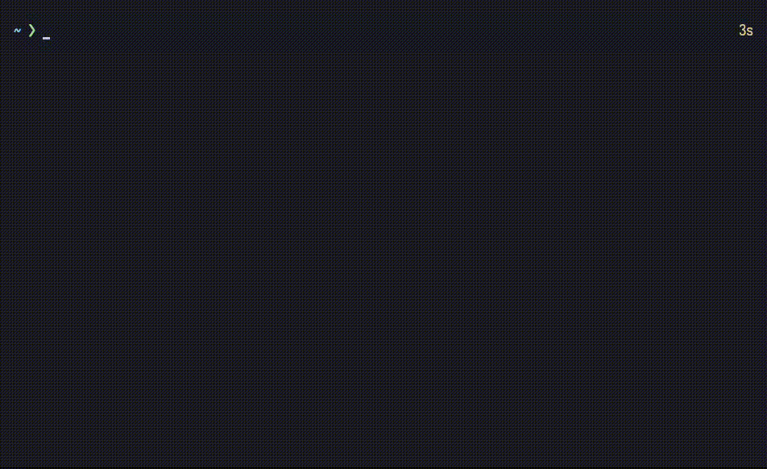
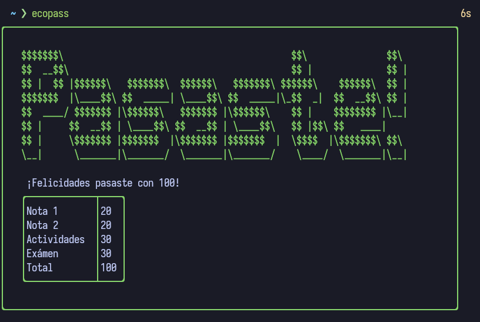
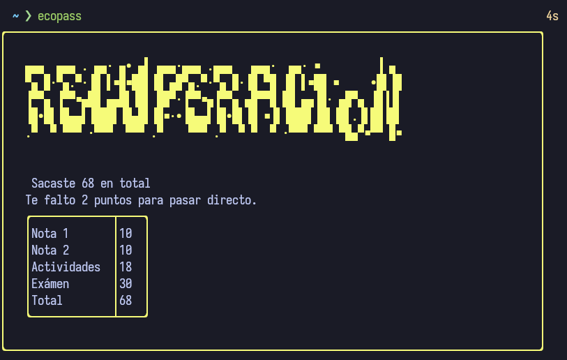
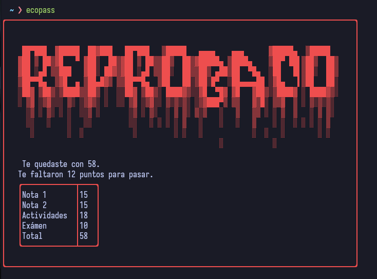

# ecopass

Breve TUI que use con el fin de poner en practicar el
framework de Go:  junto con .  

Realizado un formulario que pide notas a un estudiante
y dependiendo de ciertas con condiciones da como salida tres tipo de mensajes.  

- Aprobado
- Recuperación
- Reprobado

Así como también muestra una tabla con las notas ingresadas.

## Instalación
La instalación se puede hacer por medio de Go.
```bash
go install github.com/Luiggy102/ecopass@latest
```

## Demostración
 

### Mensajes de salida
Aprobado
 
En recuperación
 
Reprobado
 
